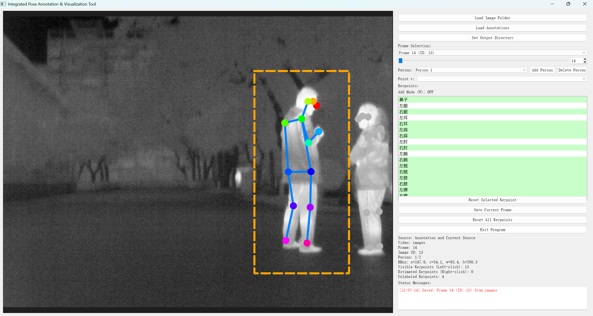

# 人体姿态标注工具（Human Pose Annotation Tool）

一个基于 PyQt5 的 Windows 桌面人体 2D 姿态标注工具。以**图片文件夹 + COCO JSON** 为核心工作流，支持**同一张图多人**的姿态标注、编辑与保存。当前配置为 COCO17（17 个人体关键点 + 19 条骨骼），可通过修改配置适配其他人体/动物骨架。

项目基于 https://github.com/Sooophy/human_pose_annotator 项目开发，增加了通用的图片文件夹和coco数据集读取能力，可以完成基础的人类姿态标注工作。

*主界面：左侧关键点视图，右侧标注控制面板*

## 功能特性

- **多人姿态标注**：同一张图可标注多个人，Person 下拉切换，互不干扰
- **COCO 格式**：`images / annotations / categories` 标准结构，关键点 `(x, y, v)` 三元组
- **纯本地运行**：数据不离开本机，适合行为学研究等敏感数据
- **灵活的关键点编辑**：
  - 吸附选中：点击关键点附近（15px）自动选中，按住左键拖拽移动
  - 放置模式：W 键开启后左键放置未标注点，放完自动关闭
  - 删除与恢复：T / Delete 删除选中点，Reset Selected 可恢复
  - 可见性标记：每个点可标为可见（v=2）或遮挡/估计（v=1）
- **实时可视化**：当前人彩色关键点 + 实线骨骼 + 橙色 bbox；非当前人灰色虚线区分
- **智能保存**：S 键静默保存；A/D 切帧仅在有修改时弹窗询问；保存时自动留 `.bak` 备份
- **可定制配置**：关键点、骨骼连接、颜色均在 `pose_config.py` 中集中定义

## 环境要求与安装

```
Python >= 3.6
PyQt5
opencv-python-headless
numpy
```

```bash
pip install -r requirements.txt
```

> 注意：请使用 `opencv-python-headless` 而非 `opencv-python`，避免与 PyQt 的 Qt 插件冲突导致无法启动。若已安装 `opencv-python`，先卸载再安装 headless 版。

## 快速开始

### 1. 启动

```bash
python annotator.py
```

### 2. 加载数据

1. 点击 **Load Image Folder** 选择图片文件夹（支持 `.jpg / .jpeg / .png`，文件名数字或命名均可，按自然顺序排序）。
2. 点击 **Load Annotations** 选择已有 COCO JSON，或直接创建新的标注文件。
   - 若还未选过图片文件夹，工具会在此步自动弹出选择框，并按每个 image 的 `file_name` 关联到图片。
3. 点击 **Set Output Directory** 指定标注保存目录（保存的 JSON 为 `annotations.json`）。
4. 加载完成后，**Frame Selection** 区可浏览各帧：下拉框列出已标注帧，滑条 / 数字框在相邻帧间跳转。

### 3. 标注流程

1. 在右侧 **Keypoints** 列表选中一个关键点（显示为中文，如"鼻子"；内部与 COCO JSON 仍用英文键名）。
2. **放置新点**：若该点尚未标注，先按 **W** 开启放置模式，再用左键在图上点击放置；放置一个点后放置模式自动关闭。
   - 放置前可在 **Point v** 下拉选择该点的可见性：`Visible (v=2)` 或 `Occluded (v=1)`。
3. **移动已有点**：左键点击关键点附近即可吸附选中，按住左键拖拽调整位置。
4. **删除与恢复**：选中点后按 **T / Delete** 删除；按 **Reset Selected Keypoint** 恢复（优先恢复选中点，无选中时恢复最近删除的点）。
5. **整体重置**：**Reset All Keypoints** 将当前人的所有点恢复到加载时的原始状态。
6. 完成后按 **S** 保存。

## 多人标注

- **切换当前人**：Person 下拉框，或按 **Tab** 循环切换（切换前自动保存当前人）。
- **新增**：**Add Person** 按钮追加一个空白的人并切换过去。
- **删除**：**Delete Person** 按钮，弹窗确认后删除当前人的关键点与框。
- 当前人的关键点/骨骼为彩色实线，其他人显示为灰色，便于区分。

> 删除/新增 Person 与编辑关键点一样属于"修改"：只有**保存**后才会写入文件；若随后切换帧时选择"不保存"，这些修改（含删除的人）会被丢弃。

## 快捷键

| 按键 | 功能 |
| ---- | ---- |
| `A` / `D` | 上一帧 / 下一帧（当前帧有未保存修改时弹窗询问是否保存） |
| `W` | 开关关键点放置模式 |
| `T` / `Delete` | 删除当前选中的关键点 |
| `S` | 静默保存当前帧 |
| `Tab` | 切换到下一个 person（自动保存） |

## 保存机制

- **保存目标**：写入输出目录下的 `annotations.json`。
- **`.bak` 备份**：保存时若 `annotations.json` 已存在，先将其备份为 `annotations.json.bak`（覆盖旧备份），再直接在原文件上写入新内容，误改时可用备份恢复。
- **保存入口**：
  - `Save Current Frame` 按钮或 `S` 键：静默保存（无弹窗，底部状态区显示保存记录）。
  - `A/D` 切帧：仅当当前帧有未保存修改时才弹窗询问，选"是"则保存并切换，选"否"则丢弃修改直接切换。
  - `Tab` 切换 person：自动静默保存。
- 保存以当前场景为准，将本帧 `annotations` 与画面中的人一一对齐：改动写回、新增追加、删除移除（含删除全部人时清空该帧标注）。

## 界面说明

- **左侧**：图片视图。支持缩放、平移；关键点、骨骼、bbox 实时绘制。
- **右侧面板**：
  - 文件控制：`Load Image Folder` / `Load Annotations` / `Set Output Directory`
  - Frame Selection：帧下拉、滑条、帧号数字框
  - Person：当前人下拉 + `Add Person` / `Delete Person`
  - Point v：新放置点的可见性
  - Keypoints：17 个关键点列表（当前人的标注状态用背景色实时反映）
  - Add Mode：显示放置模式开关状态（`W`）
  - 控制按钮：`Reset Selected Keypoint` / `Save Current Frame` / `Reset All Keypoints` / `Exit Program`
  - 元数据显示：Source / Video / Frame / Image ID / Person / BBox / 可见与遮挡点统计
  - Status Messages：底部状态消息（含时间戳的保存记录等）

## 数据格式

COCO 人体关键点标准，另在 `images` 中扩展了 `video_file`（图片文件夹名）与 `frame_number` 用于来源跟踪：

```json
{
  "images": [
    {"id": 1, "file_name": "0001.jpg", "video_file": "frames", "frame_number": 1, "width": 1920, "height": 1080}
  ],
  "annotations": [
    {
      "id": 1, "image_id": 1, "category_id": 1,
      "keypoints": [x, y, v, x, y, v, ...],
      "num_keypoints": 17,
      "bbox": [x, y, w, h],
      "area": 0
    }
  ],
  "categories": [
    {"id": 1, "name": "person", "supercategory": "person", "keypoints": [...], "skeleton": [...]}
  ]
}
```

- `keypoints` 为扁平三元组 `(x, y, v)`，`v = 0` 未标注 / `1` 遮挡·估计 / `2` 可见。
- 同一 `image_id` 对应多条 `annotations` 即多人。

## 配置（pose_config.py）

`pose_config.py` 中的 `PoseConfig` 集中定义了：

- `keypoint_names`：17 个关键点（英文键名，COCO 兼容）
- `keypoint_display_names`：界面显示的中文名
- `skeleton`：骨骼连接（COCO 索引）
- `keypoint_colors`：各关键点颜色
- `skeleton_color`：骨骼线颜色

需要适配其他骨架（如动物）时，仅需修改此文件。

## 目录结构

```
human_pose_annotator/
├── annotator.py              # 主程序（GUI + 标注逻辑）
├── pose_config.py            # 关键点 / 骨骼 / 颜色配置
├── requirements.txt          # 依赖
├── README.md                 # 本文档
├── demo/coco-pose-2017.json  # 示例 COCO 标注文件（多人）
└── images/                   # README 截图
```

## 常见问题

- **启动报 Qt 平台插件错误**：多为 OpenCV 自带的 Qt 插件与 PyQt 冲突，确认已使用 `opencv-python-headless`。
- **`Load Annotations` 后图片不显示**：需先选择与标注文件 `file_name` 匹配的图片文件夹；加载标注时会自动弹出选择框。
- **误删了关键点 / 删错了人**：未保存前切走再切回会恢复原始状态；已保存后可从 `annotations.json.bak` 恢复上一版本。

## 许可证

The MIT License (MIT)

Copyright (c) 2025 human_pose_annotator contributors

Permission is hereby granted, free of charge, to any person obtaining a copy
of this software and associated documentation files (the "Software"), to deal
in the Software without restriction, including without limitation the rights
to use, copy, modify, merge, publish, distribute, sublicense, and/or sell
copies of the Software, and to permit persons to whom the Software is
furnished to do so, subject to the following conditions:

The above copyright notice and this permission notice shall be included in
all copies or substantial portions of the Software.

THE SOFTWARE IS PROVIDED "AS IS", WITHOUT WARRANTY OF ANY KIND, EXPRESS OR
IMPLIED, INCLUDING BUT NOT LIMITED TO THE WARRANTIES OF MERCHANTABILITY,
FITNESS FOR A PARTICULAR PURPOSE AND NONINFRINGEMENT. IN NO EVENT SHALL THE
AUTHORS OR COPYRIGHT HOLDERS BE LIABLE FOR ANY CLAIM, DAMAGES OR OTHER
LIABILITY, WHETHER IN AN ACTION OF CONTRACT, TORT OR OTHERWISE, ARISING FROM,
OUT OF OR IN CONNECTION WITH THE SOFTWARE OR THE USE OR OTHER DEALINGS IN
THE SOFTWARE.

## 致谢

本工具使用 COCO 人体关键点格式标准（https://cocodataset.org/）进行人体姿态标注。
